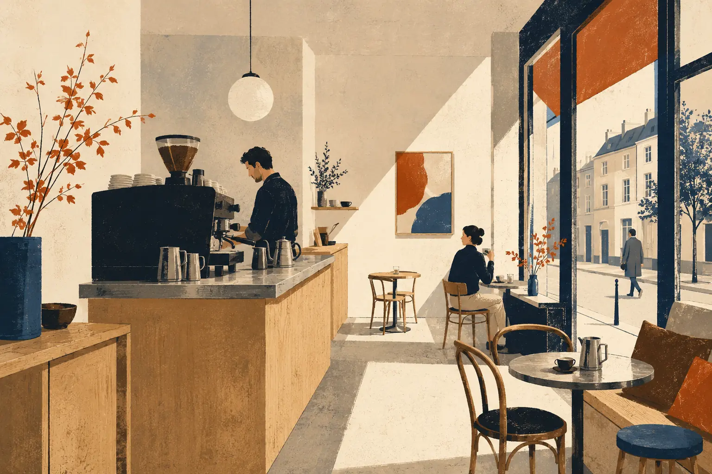

# Atelier Moka — web assets

Seven independent illustrations prepared for responsive web use.

- `*.avif`: preferred source (smallest files, modern browsers)
- `*.webp`: fallback source
- widths: 640, 960 and 1536 px
- aspect ratio: 3:2
- intrinsic dimensions: 640×426, 960×640 and 1536×1024

The 1536 px files preserve the full detail of the generated master. Use 640 and
960 px files through `srcset` so mobile devices do not download unnecessary
pixels. The original PNG masters are deliberately excluded from this production
package because they should not be served by the website.

Example:

```html
<picture>
  <source type="image/avif"
    srcset="atelier-moka-interior-wide-640.avif 640w,
            atelier-moka-interior-wide-960.avif 960w,
            atelier-moka-interior-wide-1536.avif 1536w"
    sizes="100vw">
  <source type="image/webp"
    srcset="atelier-moka-interior-wide-640.webp 640w,
            atelier-moka-interior-wide-960.webp 960w,
            atelier-moka-interior-wide-1536.webp 1536w"
    sizes="100vw">
  
</picture>
```

Use `loading="lazy"` on every image except the image visible in the first
viewport.
